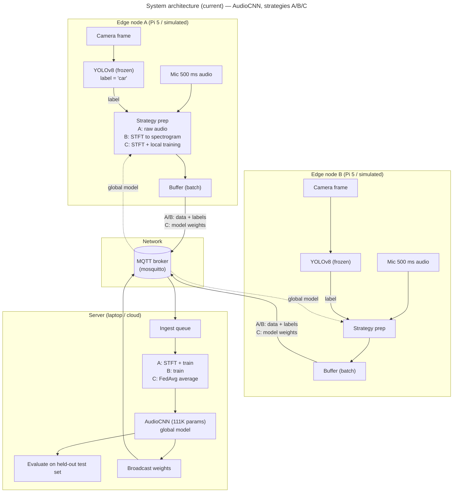
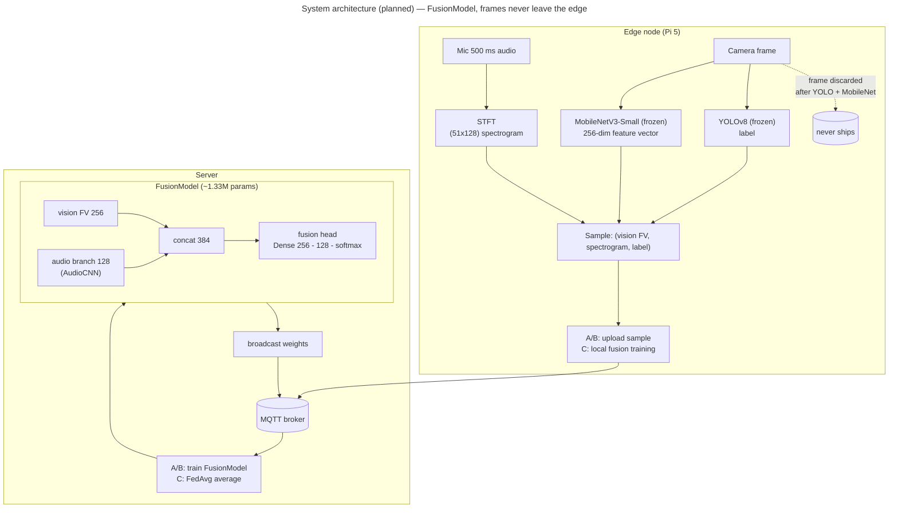
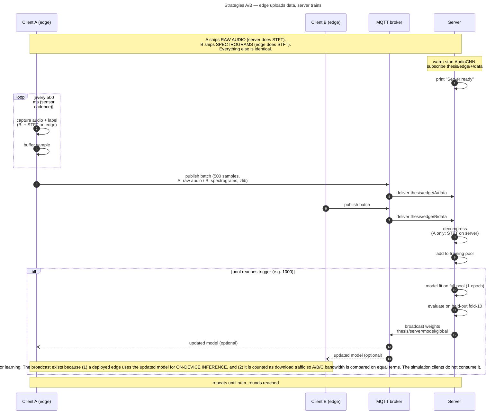
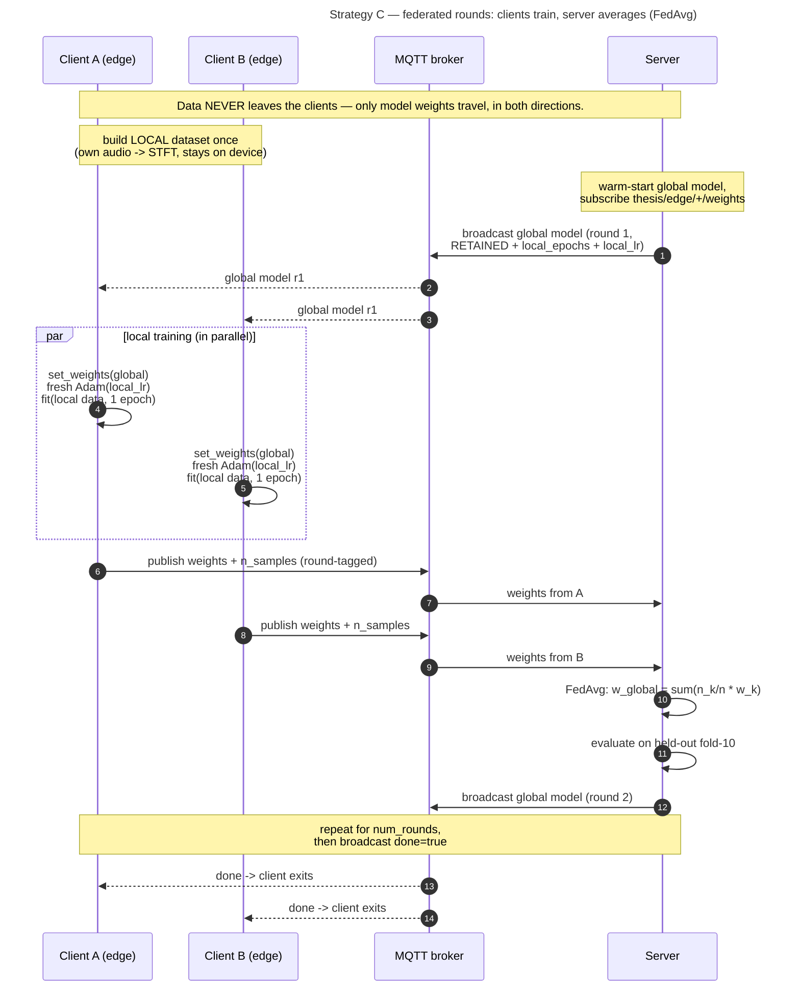
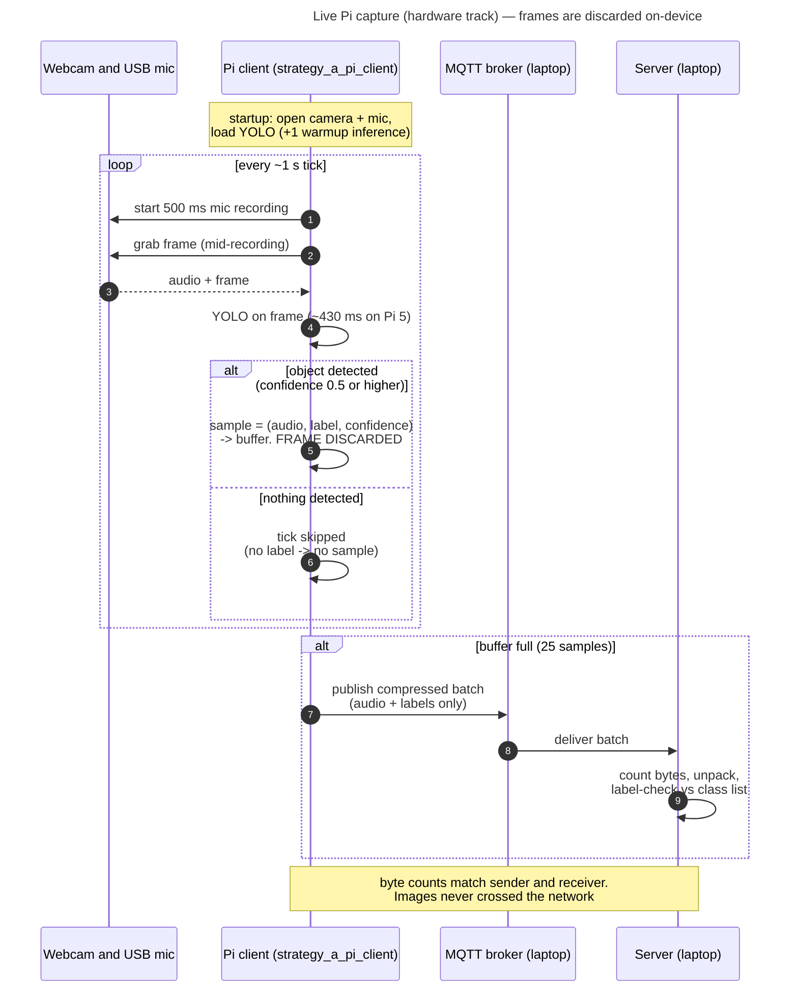

# Diagrams

Mermaid source for the report figures. GitHub renders these inline; for the
thesis document, export any diagram to SVG/PNG at https://mermaid.live (paste
the block) or with `mmdc` (mermaid-cli).

Contents:
1. System architecture — current (AudioCNN)
2. System architecture — fusion era (planned)
3. Sequence: Strategies A/B (data upload → server training)
4. Sequence: Strategy C (federated rounds, FedAvg)
5. Sequence: live Pi capture (hardware track)

---

## 1. System architecture — current (AudioCNN)

The system as measured: two edge nodes, MQTT broker, one server. The three
strategies differ only in where STFT/training run and what crosses the wire.

---

## 2. System architecture — fusion era (planned, F-track)

The FusionModel adds a vision branch at inference. Frames still never leave
the device: strategies A/B ship the MobileNetV3 **feature vector** (256
numbers, not reversible to an image) alongside the audio; C is unchanged
(everything stays local).

---

## 3. Sequence — Strategies A/B (data upload, server training)

One full cycle. The only A-vs-B difference is *who* runs STFT (highlighted).

---

## 4. Sequence — Strategy C (federated rounds, FedAvg)

Round-synchronized: the server never trains, only averages. Data never leaves
the clients; only weights travel (both directions).

---

## 5. Sequence — live Pi capture (hardware track, Strategy A validated)

The real-hardware demo: same downstream pipeline as the simulation; only the
sample source differs. Frames are discarded on-device.

---

### Exported figures (for the report)

Rendered PNGs live in [figures/](figures/):

| # | File | Diagram |
|---|---|---|
| 1 | `figures/01_architecture_current_audiocnn.png` | §1 architecture (current) |
| 2 | `figures/02_architecture_fusion_planned.png` | §2 architecture (fusion era) |
| 3 | `figures/03_sequence_strategies_ab.png` | §3 sequence A/B |
| 4 | `figures/04_sequence_strategy_c_fedavg.png` | §4 sequence C (FedAvg) |
| 5 | `figures/05_sequence_live_pi_capture.png` | §5 sequence live Pi |

Re-export after editing a diagram so source and PNG stay in sync.

### Regenerating / exporting

- GitHub renders these blocks natively.
- For the thesis: paste a block into https://mermaid.live → export SVG/PNG,
  or `npx -y @mermaid-js/mermaid-cli -i docs/DIAGRAMS.md -o figures/` to batch-export.
- Keep diagrams in sync with [ARCHITECTURE.md](ARCHITECTURE.md) (design) and
  [CODE_FLOW.md](CODE_FLOW.md) (execution) when the system changes.
